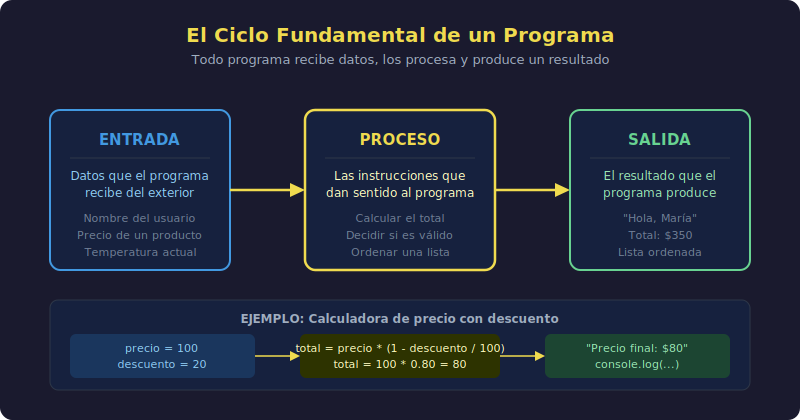

# ¿Qué es programar?

## 🎯 Objetivos

- Comprender qué hace exactamente una computadora
- Entender qué es un programa y cómo funciona
- Identificar el ciclo Entrada → Proceso → Salida
- Tener tu primer vistazo a código JavaScript real

---



---

## 1. ¿Qué hace una computadora?

Una computadora es extraordinariamente rápida y extraordinariamente obediente.

Sigue instrucciones **al pie de la letra**. Exactas. Sin interpretación. Sin improvisación.

Si le dices _suma 2 más 3_, suma 2 más 3. No más, no menos.  
Si le dices _muestra el mensaje "Hola"_, muestra exactamente "Hola".  
Pero si le escribes algo ambiguo o con errores tipográficos… falla.

> 💡 **Clave**: La computadora no adivina. Ejecuta exactamente lo que escribiste.

---

## 2. ¿Qué es un programa?

Un **programa** es una secuencia de instrucciones ordenadas que resuelven un problema o realizan una tarea.

### Analogía: una receta de cocina

```
Receta: Hacer café

1. Llenar el tanque de agua
2. Agregar café molido al filtro
3. Encender la cafetera
4. Esperar 5 minutos
5. Servir en la taza
```

Un programa funciona exactamente igual:

- **Pasos ordenados** — el orden importa, no puedes servir antes de encender
- **Instrucciones específicas** — "un poco de café" no es suficiente precisión
- **Un objetivo claro** — obtener café

La diferencia es que en programación, quien sigue los pasos es una computadora, y debe hacerlo en milisegundos.

---

## 3. El ciclo fundamental: Entrada → Proceso → Salida

Todo programa, sin importar su tamaño o complejidad, sigue este patrón:

```
[ ENTRADA ]  ──►  [ PROCESO ]  ──►  [ SALIDA ]
   datos            código           resultado
```

### Ejemplos cotidianos

| Entrada              | Proceso                       | Salida                      |
| -------------------- | ----------------------------- | --------------------------- |
| Tu nombre            | Agregar saludo                | `"¡Hola, María!"`           |
| Precio + cantidad    | Multiplicar                   | Total a pagar               |
| Temperatura en °C    | Aplicar fórmula de conversión | Temperatura en °F           |
| Usuario + contraseña | Verificar en base de datos    | Acceso permitido / denegado |
| Foto de tu cara      | Comparar con patrones         | Desbloquear celular         |

> 💡 **Ejercicio mental**: Piensa en la aplicación de tu banco. ¿Cuál es la entrada? ¿El proceso? ¿La salida?

---

## 4. Lenguajes de programación

Las computadoras solo entienden **código máquina**: unos y ceros (sistema binario).

```
// Lo que entiende directamente la CPU
10110000 01100001 11001101 00100001
```

Eso es imposible para los humanos. Por eso existen los **lenguajes de programación**: intermediarios que nos permiten escribir instrucciones en un formato más cercano al lenguaje natural.

```javascript
// JavaScript — lo que nosotros escribimos
console.log("¡Hola, mundo!");
```

El motor de JavaScript traduce ese código a instrucciones de máquina automáticamente. Nosotros nos concentramos en resolver problemas; JavaScript se encarga del resto.

---

## 5. Tu primera línea de código JavaScript

Este es un programa JavaScript completo:

```javascript
// Mostrar un mensaje en la consola
console.log("¡Bienvenido al bootcamp!");
```

Eso es todo. Una sola instrucción. Un programa real.

`console.log()` es la forma de "hablarle" a la consola: decirle que muestre algo.  
Lo que va entre los paréntesis y las comillas es el mensaje que quieres mostrar.

Ahora un programa un poco más completo:

```javascript
// Mostrar texto
console.log("Mi nombre es Ana");

// Mostrar un número (sin comillas)
console.log(25);

// Mostrar el resultado de una operación
console.log(10 + 5);
```

Lo que puedes notar aunque no entiendas todo:

1. Las instrucciones van **de arriba hacia abajo**, una por una
2. `console.log()` aparece y muestra cosas en pantalla
3. El texto va entre comillas `'...'`
4. Los números van **sin** comillas
5. La computadora puede hacer cálculos: `10 + 5` → `15`

---

## 6. ¿Por qué programar?

Programar te da un superpoder: **decirle a la computadora exactamente qué hacer**.

- Repetir manualmente 1,000 cálculos → horas de trabajo humano
- Con un programa → milisegundos

- Enviar el mismo correo a 500 personas manualmente → posible error humano
- Con un programa → exacto y en segundos

- Revisar si un formulario tiene errores campo por campo → lento
- Con un programa → instantáneo, siempre, para todos los usuarios

> 💡 Todo lo que ves en tu teléfono o computador —aplicaciones, redes sociales, mapas, videojuegos— es un programa que alguien escribió. Tú vas a aprender a hacer lo mismo.

---

## ✅ Checklist de Verificación

Antes de pasar al siguiente tema, confirma que puedes responder estas preguntas:

- [ ] ¿Qué es un programa con tus propias palabras?
- [ ] ¿Cuáles son las tres partes del ciclo fundamental?
- [ ] ¿Por qué no le escribimos código máquina directamente a la CPU?
- [ ] ¿Qué hace `console.log()`?

---

## 📚 Recursos Adicionales

- [javascript.info — ¿Qué es JavaScript?](https://javascript.info/intro)
- [MDN — JavaScript (introducción)](https://developer.mozilla.org/es/docs/Web/JavaScript)
