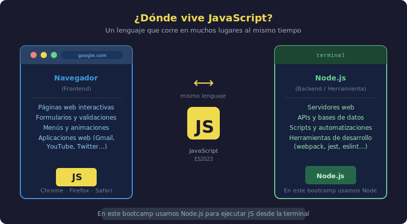

# JavaScript: ¿para qué sirve?

## 🎯 Objetivos

- Entender qué es JavaScript y dónde vive
- Conocer por qué JavaScript es un excelente primer lenguaje
- Distinguir entre JavaScript en el navegador y en el servidor

---



---

## 1. ¿Qué es JavaScript?

JavaScript es un lenguaje de programación creado en 1995. Su misión original era hacer que las páginas web pudieran **reaccionar** a las acciones del usuario: un clic, un movimiento del mouse, un formulario enviado.

Hoy es mucho más que eso.

---

## 2. ¿Dónde vive JavaScript?

### En el navegador (frontend)

Cada vez que entras a una página web y algo se mueve, cambia de color, aparece o desaparece sin recargar la página, hay JavaScript ejecutándose.

```
Tu navegador (Chrome, Firefox, Edge)
    └── Lee el archivo HTML
    └── Lee el archivo CSS  → Diseño visual
    └── Ejecuta el archivo .js → Interactividad ← JavaScript
```

Ejemplos de lo que hace JavaScript en el navegador:

- Validar que un formulario esté bien llenado antes de enviarlo
- Mostrar/ocultar un menú al hacer clic
- Actualizar el contador del carrito de compras sin recargar la página
- Animar elementos en pantalla

### En el servidor (backend)

En 2009 apareció **Node.js**: una herramienta que permite ejecutar JavaScript fuera del navegador, directamente en el servidor.

> Esta semana ya vas a usar Node.js para ejecutar tus primeros scripts.

```
Tu computador
    └── Node.js instalado
    └── Terminal: node mi-script.js  ← JavaScript corriendo sin navegador
```

### En muchos otros lugares

JavaScript también se usa hoy para:

- Crear aplicaciones móviles (React Native)
- Crear aplicaciones de escritorio (Electron — VS Code está hecho con JS)
- Controlar robots e IoT
- Crear juegos en el navegador

---

## 3. ¿Por qué JavaScript como primer lenguaje?

Hay docenas de lenguajes de programación. ¿Por qué JavaScript primero?

### Razón 1: Cero configuración para el primer experimento

Tienes un navegador. Abre las herramientas de desarrollador (F12), ve a la pestaña **Console**, escribe esto y presiona Enter:

```javascript
console.log("¡Funciona!");
```

Ya ejecutaste JavaScript. Sin instalar nada.

### Razón 2: El más usado del mundo

Según Stack Overflow Developer Survey 2024, JavaScript es el lenguaje más usado por décimo año consecutivo. Más demanda laboral = más oportunidades.

### Razón 3: Feedback inmediato

Cuando escribes JavaScript para el navegador, ves el resultado inmediatamente en pantalla. Eso acelera el aprendizaje.

### Razón 4: Un lenguaje, muchos destinos

Con JavaScript aprendes un solo lenguaje y puedes construir:

- Páginas web interactivas
- Aplicaciones del lado del servidor
- APIs
- Aplicaciones móviles
- Y más

---

## 4. JavaScript ≠ Java

Es un error muy común. JavaScript y Java son lenguajes completamente diferentes, creados por empresas distintas y con muy poco en común. El nombre es una coincidencia histórica de marketing.

|                   | JavaScript             | Java                                |
| ----------------- | ---------------------- | ----------------------------------- |
| **Creado por**    | Netscape (1995)        | Sun Microsystems (1995)             |
| **Dónde corre**   | Navegador, Node.js     | JVM (Java Virtual Machine)          |
| **Tipo**          | Dinámico, interpretado | Estático, compilado                 |
| **Uso principal** | Web, fullstack         | Aplicaciones empresariales, Android |

---

## 5. ¿Qué vamos a construir en este bootcamp?

Al terminar las 34 semanas vas a poder construir desde cero:

- Scripts de automatización con Node.js
- Aplicaciones web interactivas con DOM
- Consumidores de APIs REST
- Aplicaciones completas con persistencia de datos

Esta semana damos el primer paso: ejecutar nuestro primer script.

---

## ✅ Checklist de Verificación

- [ ] Sé que JavaScript corre tanto en el navegador como en servidores (Node.js)
- [ ] Entiendo por qué JavaScript es un buen primer lenguaje
- [ ] Sé que JavaScript y Java son lenguajes distintos
- [ ] Tengo claro que esta semana usaré Node.js para ejecutar scripts

---

## 📚 Recursos Adicionales

- [javascript.info — Una introducción a JavaScript](https://javascript.info/intro)
- [MDN — ¿Qué es JavaScript?](https://developer.mozilla.org/es/docs/Learn/JavaScript/First_steps/What_is_JavaScript)
