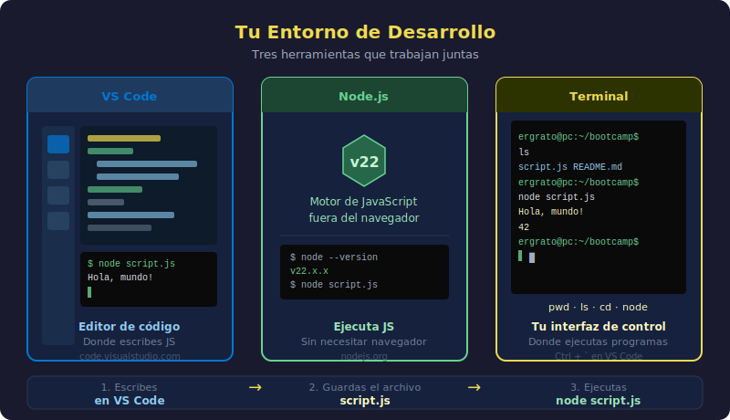

# Configurar el Entorno de Desarrollo

## 🎯 Objetivos

- Instalar VS Code y las extensiones esenciales
- Instalar Node.js para ejecutar JavaScript
- Dominar los comandos básicos de terminal
- Crear y ejecutar tu primer archivo `.js`

---



---

## 1. VS Code — Tu editor de código

Visual Studio Code (VS Code) es el editor más popular para JavaScript. Es gratuito, rápido y tiene miles de extensiones.

### Instalación

1. Ve a [https://code.visualstudio.com](https://code.visualstudio.com)
2. Descarga la versión para tu sistema operativo (Windows / macOS / Linux)
3. Instala normalmente siguiendo el asistente

### Extensiones esenciales

Una vez abierto VS Code, instala estas extensiones (Ctrl+Shift+X):

| Extensión                          | Para qué sirve                                 |
| ---------------------------------- | ---------------------------------------------- |
| **ESLint**                         | Detecta errores en tu código mientras escribes |
| **Prettier - Code formatter**      | Formatea automáticamente tu código             |
| **JavaScript (ES6) code snippets** | Atajos para escribir código más rápido         |
| **Code Runner**                    | Ejecutar scripts JS con un clic desde VS Code  |

> 💡 Para instalar: Ctrl+Shift+X → buscar el nombre → hacer clic en "Instalar"

---

## 2. Node.js — Ejecutar JavaScript sin navegador

Node.js es el motor que nos permite correr JavaScript desde la terminal, fuera del navegador.

### Instalación

1. Ve a [https://nodejs.org](https://nodejs.org)
2. Descarga la versión **LTS** (Long Term Support) — la etiquetada como "Recomendado para la mayoría"
3. Instala siguiendo el asistente (acepta todo por defecto)

### Verificar que quedó instalado

Abre una terminal y ejecuta:

```bash
node --version
```

Deberías ver algo como:

```
v22.x.x
```

Si aparece un número de versión, ¡Node.js está instalado correctamente!

---

## 3. La terminal — Tu nueva herramienta

La terminal (también llamada consola o línea de comandos) te permite comunicarte con tu computador escribiendo instrucciones de texto.

### Cómo abrirla

- **Windows**: Busca "PowerShell" o instala "Windows Terminal" desde la tienda
- **macOS**: Cmd+Espacio → escribe "Terminal" → Enter
- **Linux**: Ctrl+Alt+T

En VS Code también puedes abrir una terminal integrada con **Ctrl+`** (acento grave).

### Comandos básicos que necesitas

```bash
# Ver en qué carpeta estás
pwd

# Listar archivos y carpetas de la carpeta actual
ls

# Entrar a una carpeta
cd nombre-de-la-carpeta

# Subir un nivel (ir a la carpeta padre)
cd ..

# Crear una carpeta nueva
mkdir nombre-carpeta

# Crear un archivo vacío (macOS/Linux)
touch nombre-archivo.js

# Limpiar la pantalla de la terminal
clear
```

> 💡 **Atajo útil**: Presiona la tecla `↑` (arriba) para repetir el comando anterior.

---

## 4. Tu primer archivo JavaScript

Vamos a crear y ejecutar nuestro primer script paso a paso.

### Paso 1: Crear una carpeta de trabajo

```bash
mkdir mis-primeros-scripts
cd mis-primeros-scripts
```

### Paso 2: Crear el archivo

```bash
touch hola-mundo.js
```

(En Windows, puedes crearlo directamente desde VS Code: File → New File)

### Paso 3: Abrir en VS Code

```bash
code .
```

El punto `.` significa "abrir la carpeta actual en VS Code".

### Paso 4: Escribir el código

En VS Code, abre `hola-mundo.js` y escribe:

```javascript
// Mi primer programa JavaScript
console.log("¡Hola, mundo!");
console.log("Estoy aprendiendo a programar");
console.log(2026);
```

### Paso 5: Ejecutar el script

En la terminal (dentro de la carpeta `mis-primeros-scripts`):

```bash
node hola-mundo.js
```

Deberías ver en la terminal:

```
¡Hola, mundo!
Estoy aprendiendo a programar
2026
```

> 🎉 **¡Felicitaciones!** Acabas de ejecutar tu primer programa JavaScript.

---

## 5. Estructura importante de un proyecto JS

```
mi-proyecto/
├── script.js         ← Código JavaScript
├── README.md         ← Documentación del proyecto
└── .gitignore        ← Archivos que Git debe ignorar
```

Por ahora trabajaremos solo con archivos `.js`. La estructura crece con el tiempo.

---

## 6. Errores comunes al empezar

### Error: `node: command not found`

Node.js no está instalado o no se reconoce en la terminal. Reinstala Node.js y reinicia la terminal.

### Error: `Cannot find module`

Estás ejecutando `node` en una carpeta diferente a donde está el archivo. Usa `cd` para ir a la carpeta correcta.

### Error: `SyntaxError: Unexpected token`

Hay un error de escritura en tu código (falta una comilla, un paréntesis, etc.). Lee el mensaje de error con atención — dice exactamente en qué línea está el problema.

> 💡 **Los errores son normales y útiles**. Un error no significa que fallaste — significa que el motor de JavaScript encontró algo que no entiende y te está pidiendo que lo corrijas. Lee el mensaje, búscalo si no entiendes, y corrígelo.

---

## ✅ Checklist de Verificación

- [ ] VS Code instalado con las 4 extensiones recomendadas
- [ ] `node --version` devuelve un número en mi terminal
- [ ] Sé navegar carpetas con `cd` y `ls` en la terminal
- [ ] Creé y ejecuté exitosamente `hola-mundo.js` con `node`
- [ ] Vi la salida en la terminal

---

## 📚 Recursos Adicionales

- [nodejs.org — Documentación oficial](https://nodejs.org/es/docs)
- [VS Code — Primeros pasos](https://code.visualstudio.com/docs/introvideos/basics)
- [Guía de terminal para principiantes](https://developer.mozilla.org/es/docs/Learn/Tools_and_testing/Understanding_client-side_tools/Command_line)
