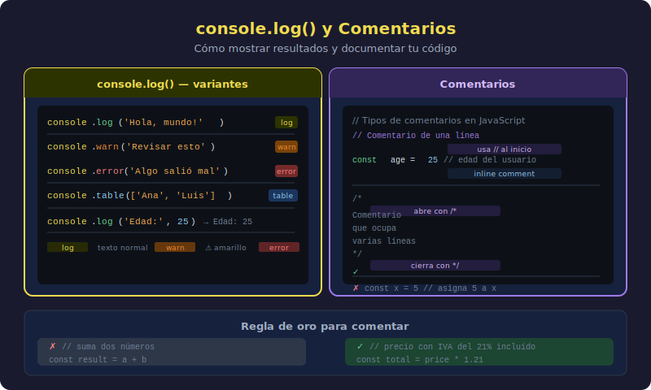

# console.log() y Comentarios

## 🎯 Objetivos

- Dominar `console.log()` para comunicarse con la consola
- Conocer las variantes: `warn`, `error`, `info`
- Escribir comentarios de una línea y multilínea
- Entender por qué y cuándo comentar el código

---



---

## 1. console.log() — Tu ventana al programa

Cuando un programa se está ejecutando, necesitas una forma de ver qué está pasando internamente. `console.log()` es esa ventana.

```javascript
// Mostrar un texto
console.log("Hola desde JavaScript");

// Mostrar un número
console.log(42);

// Mostrar el resultado de una operación
console.log(10 + 5);
```

Salida en consola:

```
Hola desde JavaScript
42
15
```

### Anatomía de console.log()

```
console  .  log  (  'mensaje'  )  ;
   │          │       │            │
objeto    método   argumento   fin línea
```

- `console` — objeto que representa la consola del navegador o terminal
- `.log` — método (función) que pertenece a ese objeto
- `('mensaje')` — lo que quieres mostrar va dentro de los paréntesis
- `;` — punto y coma al final de cada instrucción

---

## 2. Mostrar varios valores a la vez

Puedes pasar varios argumentos separados por coma:

```javascript
// Mostrar múltiples valores en una sola línea
console.log("Nombre:", "Ana", "Edad:", 28);

// Salida: Nombre: Ana Edad: 28
```

O varias llamadas seguidas (cada una en su propia línea):

```javascript
console.log("=== Mi Presentación ===");
console.log("Nombre: Juan");
console.log("Ciudad: Bogotá");
console.log("=======================");
```

---

## 3. Variantes de console

Además de `log`, hay otras variantes útiles que cambian el formato visual en la consola:

```javascript
// Mensaje normal — texto blanco/negro
console.log("Esto es un mensaje normal");

// Advertencia — fondo amarillo con ícono ⚠️
console.warn("Cuidado: esto podría ser un problema");

// Error — texto rojo con ícono ❌
console.error("Error: algo salió mal");

// Información — ícono ℹ️
console.info("Información adicional del sistema");

// Limpiar la consola
console.clear();
```

> 💡 Durante el desarrollo usarás mucho `console.log()` para "espiar" el estado de tu programa. Es la herramienta de debugging más básica y más usada.

---

## 4. Comentarios de una línea

Un comentario es texto que JavaScript **ignora completamente**. Existe solo para los humanos: para explicar qué hace el código o por qué lo hace.

```javascript
// Esto es un comentario — JavaScript lo ignora
console.log("Esta línea sí se ejecuta");

// Los comentarios van al inicio de la línea
// o después del código en la misma línea

console.log(100 + 200); // Suma precio base más envío
```

> ⚠️ **Convenio de este bootcamp**: Los comentarios se escriben siempre en **español**. El código (nombres de variables, funciones) se escribe en **inglés**. Esto prepara para trabajar en equipos internacionales.

---

## 5. Comentarios multilínea

Para comentarios que ocupan más de una línea:

```javascript
/*
  Este bloque de código calcula el precio final
  de una compra, incluyendo impuestos y descuentos.
  
  Autor: Ana García
  Fecha: enero 2026
*/
console.log("Calculando precio final...");
```

También se usan al inicio de un archivo para documentar su propósito:

```javascript
/*
 * script.js
 *
 * Mi primera presentación en JavaScript
 * Este script muestra información personal en la consola
 */

console.log("¡Hola, soy Ana!");
```

---

## 6. ¿Cuándo y cómo comentar?

### Comenta el "por qué", no el "qué"

```javascript
// ❌ Mal comentario — dice lo mismo que el código
// Mostrar el texto "Hola"
console.log("Hola");

// ✅ Buen comentario — explica la razón o el contexto
// Saludo inicial que aparece cada vez que el usuario abre la app
console.log("Hola");
```

### Comentarios para deshabilitar código

Durante el desarrollo, puedes "apagar" temporalmente una línea sin borrarla:

```javascript
console.log("Esta línea se ejecuta");
// console.log('Esta línea está desactivada temporalmente');
console.log("Esta también se ejecuta");
```

Esto es muy útil para probar variantes sin perder el código original.

---

## 7. Buenas prácticas

| Práctica                            | Descripción                                      |
| ----------------------------------- | ------------------------------------------------ |
| Comenta el "por qué"                | Explica la intención, no la mecánica obvia       |
| Mantén los comentarios actualizados | Un comentario desactualizado es peor que ninguno |
| Un `;` al final de cada instrucción | Cierra cada sentencia con punto y coma           |
| Una instrucción por línea           | No pongas dos instrucciones en la misma línea    |

---

## ✅ Checklist de Verificación

- [ ] Sé usar `console.log()` para mostrar texto, números y expresiones
- [ ] Puedo pasar múltiples argumentos a `console.log()` separados por coma
- [ ] Conozco la diferencia entre `log`, `warn` y `error`
- [ ] Sé escribir comentarios de una línea con `//`
- [ ] Sé escribir comentarios multilínea con `/* ... */`
- [ ] Entiendo que los comentarios van en español y el código en inglés

---

## 📚 Recursos Adicionales

- [MDN — console](https://developer.mozilla.org/es/docs/Web/API/console)
- [javascript.info — Hola, mundo!](https://javascript.info/hello-world)
