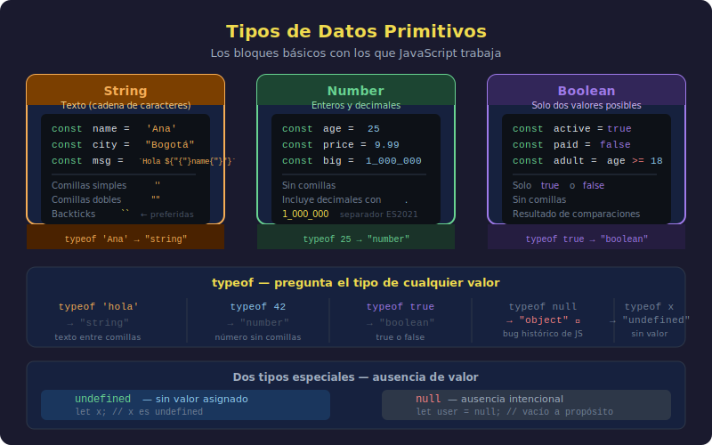

# Tipos de Datos Primitivos

## 🎯 Objetivos

- Comprender qué es un tipo de dato y por qué importa
- Conocer los tres tipos primitivos básicos: string, number y boolean
- Usar `typeof` para identificar el tipo de cualquier valor
- Entender brevemente `null` y `undefined`

---



---

## 1. ¿Qué es un tipo de dato?

Los programas trabajan con datos. Pero no todos los datos son iguales:

- `"Hola"` es texto
- `42` es un número
- `true` es un valor lógico

JavaScript necesita saber con qué tipo de dato está trabajando para poder operar correctamente. Por ejemplo:

```javascript
// Con números, + suma
console.log(5 + 3); // 8

// Con texto, + concatena
console.log("5" + "3"); // "53"
```

¿Notaste la diferencia? El tipo de dato cambia completamente el comportamiento.

---

## 2. String — Texto

Un **string** es cualquier secuencia de caracteres (letras, números, espacios, símbolos) encerrada entre comillas.

```javascript
// Comillas simples
console.log("Hola, mundo");

// Comillas dobles (equivalentes)
console.log("También funciona así");

// Backticks (template literals — los aprenderemos más adelante)
console.log(`Y también así`);

// Un string puede contener números (pero sigue siendo texto)
console.log("Mi número de teléfono es 123456789");

// Un string vacío es válido
console.log("");
```

### Propiedades básicas de los strings

```javascript
// Longitud — cuántos caracteres tiene el string
console.log("JavaScript".length); // 10

// Los strings son inmutables — no puedes cambiar un carácter
// Pero sí puedes crear strings nuevos a partir de otros
```

---

## 3. Number — Números

JavaScript tiene un solo tipo para todos los números (enteros y decimales):

```javascript
// Números enteros
console.log(42);
console.log(-10);
console.log(0);

// Números decimales (el separador decimal es el punto, no la coma)
console.log(3.14);
console.log(-0.5);
console.log(100.0);

// Operaciones matemáticas básicas
console.log(10 + 3); // 13  — suma
console.log(10 - 3); // 7   — resta
console.log(10 * 3); // 30  — multiplicación
console.log(10 / 3); // 3.333... — división
console.log(10 % 3); // 1   — módulo (resto de la división)
console.log(2 ** 10); // 1024 — potencia
```

### Casos especiales

```javascript
// Infinity — resultado de dividir por cero
console.log(10 / 0); // Infinity

// NaN — "Not a Number" — resultado de operaciones inválidas
console.log("texto" * 2); // NaN
console.log(0 / 0); // NaN
```

---

## 4. Boolean — Verdadero o Falso

Un **boolean** solo puede tener uno de dos valores: `true` o `false`. Es el tipo de dato de las decisiones lógicas.

```javascript
// Solo dos valores posibles
console.log(true);
console.log(false);

// Comparaciones producen booleans
console.log(5 > 3); // true  — 5 es mayor que 3
console.log(5 < 3); // false — 5 no es menor que 3
console.log(5 === 5); // true  — 5 es igual a 5
console.log(5 !== 3); // true  — 5 es diferente de 3
```

> 💡 Los booleans son fundamentales para las decisiones (`if/else`) que aprenderemos en la semana 5. Por ahora, lo importante es saber que existen.

---

## 5. typeof — Preguntar el tipo de un valor

`typeof` es un operador que devuelve el tipo de cualquier valor como texto:

```javascript
console.log(typeof "Hola"); // "string"
console.log(typeof 42); // "number"
console.log(typeof 3.14); // "number"
console.log(typeof true); // "boolean"
console.log(typeof false); // "boolean"
```

Es muy útil cuando no estás seguro del tipo de un valor o cuando estás depurando:

```javascript
// Ejemplo de uso de typeof para depurar
const edad = 25;
console.log(typeof edad); // "number" — confirmamos el tipo
```

---

## 6. undefined y null (breve introducción)

Hay dos tipos más que vas a encontrar pronto:

```javascript
// undefined — una variable que existe pero no tiene valor asignado
let nombre;
console.log(typeof nombre); // "undefined"

// null — la ausencia intencional de valor (lo colocamos explícitamente)
let resultado = null;
console.log(typeof resultado); // "object" (quirk histórico de JS)
```

> ⚠️ **Nota curiosa**: `typeof null` devuelve `"object"`, no `"null"`. Es un error histórico de JavaScript que no se puede corregir sin romper millones de sitios web. Solo hay que conocerlo.

---

## 7. Tabla resumen

| Tipo      | Ejemplo             | typeof             |
| --------- | ------------------- | ------------------ |
| String    | `'Hola'`, `"mundo"` | `"string"`         |
| Number    | `42`, `3.14`, `-5`  | `"number"`         |
| Boolean   | `true`, `false`     | `"boolean"`        |
| Undefined | `undefined`         | `"undefined"`      |
| Null      | `null`              | `"object"` (quirk) |

---

## ✅ Checklist de Verificación

- [ ] Sé qué es un string y cómo escribirlo (con comillas)
- [ ] Sé qué es un number y que los decimales usan punto
- [ ] Sé que boolean solo tiene dos valores: `true` y `false`
- [ ] Sé usar `typeof` para identificar el tipo de cualquier valor
- [ ] Conozco la existencia de `undefined` y `null`
- [ ] Entiendo por qué `typeof null` devuelve `"object"`

---

## 📚 Recursos Adicionales

- [MDN — Tipos de datos en JavaScript](https://developer.mozilla.org/es/docs/Web/JavaScript/Data_structures)
- [javascript.info — Tipos de datos](https://javascript.info/types)
