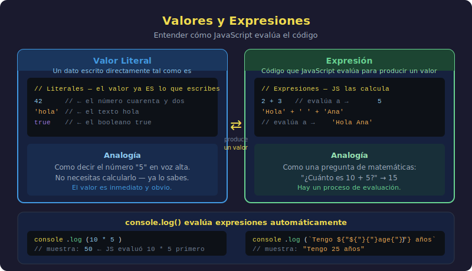

# Valores y Expresiones

## 🎯 Objetivos

- Distinguir un valor literal de una expresión
- Entender que JavaScript evalúa las expresiones antes de mostrarlas
- Combinar operaciones y entender el resultado

---



---

## 1. ¿Qué es un valor literal?

Un **valor literal** es un dato escrito directamente en el código, tal cual. No se calcula, no depende de nada: ahí está, escrito.

```javascript
// Valores literales — datos tal cual, sin transformación
console.log("JavaScript"); // string literal
console.log(42); // number literal
console.log(true); // boolean literal
```

El dato que ves es exactamente lo que JavaScript usa. No hay paso intermedio.

---

## 2. ¿Qué es una expresión?

Una **expresión** es cualquier trozo de código que **produce un valor**. JavaScript la evalúa (calcula) antes de usarla.

```javascript
// Expresión aritmética — JavaScript la evalúa y produce un número
console.log(10 + 5); // JavaScript calcula → 15

// Expresión de texto — JavaScript une los strings
console.log("Hola" + " " + "mundo"); // → "Hola mundo"

// Expresión de comparación — produce un boolean
console.log(10 > 5); // JavaScript evalúa → true
```

> 💡 **Regla clave**: Donde JavaScript espera un valor, tú puedes poner una expresión. JavaScript la evaluará automáticamente y usará el resultado.

---

## 3. Diferencia visual

```javascript
// Valor literal: el dato está escrito directamente
console.log(15);

// Expresión: JavaScript debe calcularlo primero
console.log(10 + 5); // → 15 (mismo resultado, distinto camino)
```

Ambas líneas producen `15` en la consola. La diferencia está en si JavaScript tuvo que hacer un trabajo para llegar al valor.

---

## 4. Declaración vs Expresión

- Una **expresión** produce un valor: `10 + 5`, `'Hola'`, `true`
- Una **declaración** (o sentencia) realiza una acción: `console.log(...)`, `if (...)`, `for (...)`

```javascript
// Declaración — realiza una acción (mostrar en consola)
console.log("Hola");

// La parte entre paréntesis ES una expresión que produce 'Hola'
// La declaración completa (console.log) usa esa expresión
```

---

## 5. Expresiones dentro de expresiones

Las expresiones se pueden combinar:

```javascript
// Cada parte es una expresión que produce un valor
console.log(2 + 3 * 4); // → 14 (respeta precedencia: * antes que +)
console.log((2 + 3) * 4); // → 20 (paréntesis cambian el orden)

// String con número combinados con +
console.log("El resultado es: " + (10 + 5)); // → "El resultado es: 15"
```

> ⚠️ **Atención con el `+`**: Si uno de los operandos es un string, `+` concatena en lugar de sumar:

```javascript
console.log(10 + 5); // → 15      (suma numérica)
console.log("10" + 5); // → "105"   (concatenación — '10' es string)
console.log(10 + "5"); // → "105"   (concatenación — '5' es string)
```

---

## 6. console.log() evalúa expresiones automáticamente

`console.log()` no muestra el código que escribiste — muestra el **resultado** de evaluar lo que escribiste:

```javascript
// JavaScript evalúa la expresión primero, luego muestra el resultado
console.log(100 / 4); // → 25
console.log(2 ** 8); // → 256
console.log("Java" + "Script"); // → "JavaScript"
console.log(3 > 2); // → true
console.log(typeof "hola"); // → "string"
```

---

## 7. Resumen visual

```
VALOR LITERAL         →  console.log( 'hola'  )  →  "hola"
EXPRESIÓN ARITMÉTICA  →  console.log( 5 + 3   )  →  8
EXPRESIÓN LÓGICA      →  console.log( 5 > 3   )  →  true
EXPRESIÓN DE STRING   →  console.log('a' + 'b')  →  "ab"
```

JavaScript siempre evalúa primero, luego usa el resultado.

---

## ✅ Checklist de Verificación

- [ ] Sé qué es un valor literal y puedo identificar ejemplos
- [ ] Sé qué es una expresión y entiendo que JavaScript la evalúa
- [ ] Entiendo por qué `'10' + 5` produce `"105"` y no `15`
- [ ] Conozco la diferencia entre declaración y expresión
- [ ] Sé que `console.log()` muestra el resultado evaluado, no el código

---

## 📚 Recursos Adicionales

- [javascript.info — Operadores básicos](https://javascript.info/operators)
- [MDN — Expresiones y operadores](https://developer.mozilla.org/es/docs/Web/JavaScript/Guide/Expressions_and_Operators)
