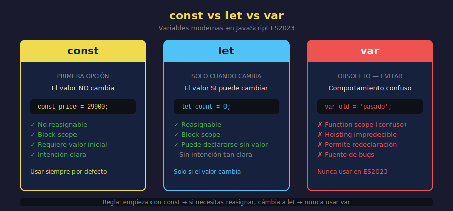

# const y let — Variables Modernas

## 🎯 Objetivos

- Entender qué es una variable y para qué sirve
- Declarar variables con `const` y `let`
- Saber cuándo usar cada una
- Entender por qué `var` no se debe usar

---



---

## 1. ¿Qué es una variable?

Una **variable** es un nombre que apunta a un valor guardado en memoria. En lugar de escribir el valor una y otra vez, lo guardas una vez con un nombre y lo reutilizas.

```javascript
// Sin variables — repetimos el dato
console.log("JavaScript ES2023");
console.log("Aprendiendo JavaScript ES2023");
console.log("Curso de JavaScript ES2023");

// Con variable — el dato vive en un lugar, el nombre lo referencia
const courseName = "JavaScript ES2023";
console.log(courseName);
console.log("Aprendiendo " + courseName);
console.log("Curso de " + courseName);
```

Si mañana el nombre cambia, solo lo modificas en un lugar.

---

## 2. const — El valor no cambia

`const` (de _constant_) declara una variable cuyo valor **no puede reasignarse**. Es la opción por defecto en JavaScript moderno.

```javascript
// Declaración con const
const language = "JavaScript";
const year = 2026;
const isActive = true;

// Leer la variable — sin problema
console.log(language); // JavaScript
console.log(year); // 2026
console.log(isActive); // true

// Intentar reasignar — ERROR
// language = 'Python'; // ❌ TypeError: Assignment to constant variable
```

### ¿Cuándo usar const?

Úsala **siempre por defecto**. Si no necesitas cambiar el valor, usa `const`.

```javascript
// Datos de configuración — nunca cambian
const MAX_RETRIES = 3;
const API_VERSION = "v2";
const PI = 3.14159;

// Datos de una entidad — la referencia no cambia
const userName = "Ana García";
const productPrice = 29900;
const isAvailable = true;
```

---

## 3. let — El valor puede cambiar

`let` declara una variable cuyo valor **sí puede reasignarse**. Úsala solo cuando sepas que el valor va a cambiar.

```javascript
// Declaración con let
let score = 0;
let message = "Iniciando...";

console.log(score); // 0
console.log(message); // Iniciando...

// Reasignar — perfectamente válido
score = 10;
message = "¡Obtuviste puntos!";

console.log(score); // 10
console.log(message); // ¡Obtuviste puntos!
```

### ¿Cuándo usar let?

Solo cuando el valor **necesita cambiar** durante la ejecución del programa: contadores, acumuladores, estados que se actualizan.

```javascript
// Contador que se incrementa
let count = 0;
count = count + 1; // → 1
count = count + 1; // → 2

// Estado que cambia
let isLoggedIn = false;
isLoggedIn = true; // el usuario inició sesión

// Resultado que se va construyendo
let total = 0;
total = total + 100;
total = total + 250;
console.log(total); // 350
```

---

## 4. var — El pasado que evitamos

`var` es la forma antigua de declarar variables (pre-2015). Tiene comportamientos confusos que llevaron a muchos bugs históricos en JavaScript.

```javascript
// var tiene "function scope" (no block scope)
// var se "eleva" al inicio (hoisting)
// var puede declararse dos veces sin error

// ❌ NUNCA uses var en este bootcamp
var oldVariable = "esto es del pasado";
```

**Regla simple**: si ves `var` en código, sabes que es código viejo o mal escrito.

---

## 5. Declaración vs inicialización

```javascript
// Declarar e inicializar al mismo tiempo (lo más común)
const name = "Carlos";

// Declarar sin inicializar (solo con let — const requiere valor inmediato)
let status;
console.log(status); // undefined — aún no tiene valor

// Inicializar después
status = "active";
console.log(status); // active

// Con const — OBLIGATORIO inicializar al declarar
// const id; // ❌ SyntaxError: Missing initializer in const declaration
const id = 42; // ✅
```

---

## 6. Comparación rápida

| Característica           | `const`               | `let`             | `var`    |
| ------------------------ | --------------------- | ----------------- | -------- |
| ¿Se puede reasignar?     | ❌ No                 | ✅ Sí             | ✅ Sí    |
| ¿Requiere valor inicial? | ✅ Sí                 | ❌ No             | ❌ No    |
| Scope                    | Bloque                | Bloque            | Función  |
| ¿Usar en ES2023?         | ✅ **Primera opción** | ✅ Solo si cambia | ❌ Nunca |

---

## 7. Regla práctica

> 1. Empieza siempre con `const`
> 2. Si el linter o el programa se queja de que necesitas reasignar, cámbiala a `let`
> 3. Nunca uses `var`

---

## ✅ Checklist de Verificación

- [ ] ¿Usas `const` para valores que no cambian?
- [ ] ¿Usas `let` solo donde el valor realmente cambia?
- [ ] ¿No hay ningún `var` en tu código?
- [ ] ¿Todas las `const` están inicializadas en la declaración?
