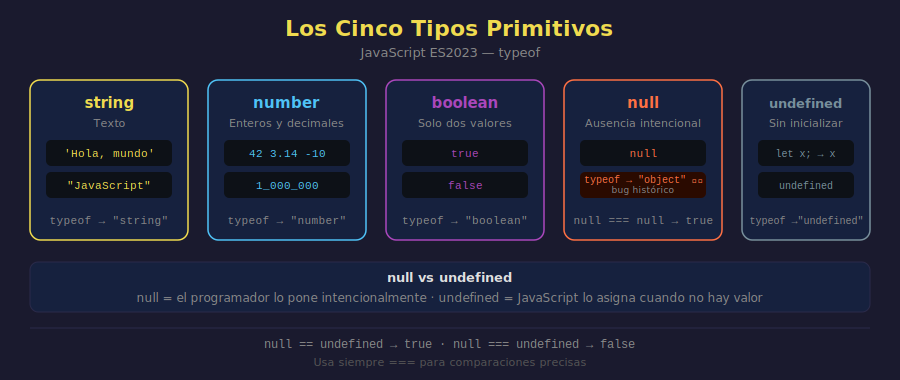

# Tipos Primitivos Completos

## 🎯 Objetivos

- Conocer los cinco tipos primitivos de JavaScript
- Entender la diferencia entre `null` y `undefined`
- Usar `typeof` para identificar todos los tipos
- Conocer la famosa trampa: `typeof null === 'object'`

---



---

## 1. Los cinco tipos primitivos

JavaScript tiene cinco tipos primitivos básicos. Un valor primitivo es un dato simple que no es un objeto.

| Tipo        | Ejemplo         | Descripción                   |
| ----------- | --------------- | ----------------------------- |
| `string`    | `'Hola'`        | Texto                         |
| `number`    | `42`, `3.14`    | Números (enteros y decimales) |
| `boolean`   | `true`, `false` | Verdadero o falso             |
| `null`      | `null`          | Ausencia intencional de valor |
| `undefined` | `undefined`     | Variable declarada sin valor  |

> Nota: `bigint` y `symbol` existen pero se cubren en etapas posteriores.

---

## 2. string, number, boolean — repaso rápido

Ya los conoces de la Semana 1. Ahora los declaramos con variables:

```javascript
// string — texto
const productName = "Laptop Pro";
const greeting = "Hola, mundo";
const multiline = `Precio:
  alto`;

// number — enteros y decimales son el mismo tipo
const stock = 48;
const price = 1299.99;
const temperature = -5;

// boolean — solo dos valores posibles
const isAvailable = true;
const isExpired = false;
```

---

## 3. null — ausencia intencional

`null` representa **la ausencia intencional de un valor**. El programador lo asigna explícitamente para decir: "aquí no hay nada (por ahora)".

```javascript
// Declarar que algo no tiene valor todavía
const selectedUser = null; // ningún usuario seleccionado aún
const lastError = null; // no ha ocurrido ningún error

console.log(selectedUser); // null
console.log(lastError); // null
```

`null` no aparece solo — siempre lo pone el programador.

---

## 4. undefined — sin inicializar

`undefined` significa que una variable fue **declarada pero no tiene valor asignado**. JavaScript lo asigna automáticamente.

```javascript
// JavaScript asigna undefined automáticamente
let userInput;
console.log(userInput); // undefined

// Después de asignar, ya no es undefined
userInput = "Ana";
console.log(userInput); // Ana
```

### null vs undefined — la diferencia clave

```javascript
let notInitialized; // undefined — JavaScript no sabe qué hay aquí
let intentionallyEmpty = null; // null — el programador dice: "aquí no hay nada"

console.log(notInitialized); // undefined
console.log(intentionallyEmpty); // null

// Son iguales con == (igualdad débil) pero distintos con === (igualdad estricta)
console.log(null == undefined); // true  — comparten "vacío"
console.log(null === undefined); // false — son tipos distintos
```

---

## 5. typeof para todos los tipos

`typeof` devuelve el tipo de un valor como string:

```javascript
const name = "Ana";
const age = 28;
const isActive = true;
let pending;
const empty = null;

console.log(typeof name); // "string"
console.log(typeof age); // "number"
console.log(typeof isActive); // "boolean"
console.log(typeof pending); // "undefined"
console.log(typeof empty); // "object" ← ¡sorpresa!
```

---

## 6. La trampa histórica: typeof null

```javascript
console.log(typeof null); // "object"
```

Este es uno de los bugs históricos más famosos de JavaScript. `null` **no es un objeto**, pero `typeof null` devuelve `"object"` por un error que se introdujo en 1995 y nunca se corrigió para no romper código existente.

**¿Cómo detectar null correctamente?**

```javascript
const value = null;

// ❌ typeof no sirve para detectar null
console.log(typeof value === "object"); // true — ¡engañoso!

// ✅ comparación directa con ===
console.log(value === null); // true — correcto
```

---

## 7. Tabla completa de typeof

| Valor            | `typeof` devuelve           |
| ---------------- | --------------------------- |
| `'texto'`        | `"string"`                  |
| `42`             | `"number"`                  |
| `3.14`           | `"number"`                  |
| `true` / `false` | `"boolean"`                 |
| `undefined`      | `"undefined"`               |
| `null`           | `"object"` ⚠️ bug histórico |
| `{}`             | `"object"`                  |
| `[]`             | `"object"`                  |
| `function(){}`   | `"function"`                |

---

## ✅ Checklist de Verificación

- [ ] ¿Distingues cuándo usar `null` vs `undefined`?
- [ ] ¿Recuerdas que `typeof null === 'object'` es un bug histórico?
- [ ] ¿Sabes detectar `null` con `=== null` en lugar de `typeof`?
- [ ] ¿Puedes nombrar los cinco tipos primitivos de memoria?
