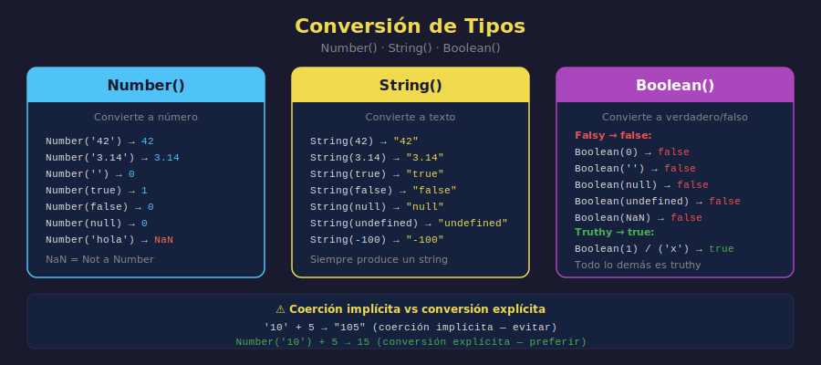

# Conversión de Tipos

## 🎯 Objetivos

- Entender qué es la conversión de tipos (type coercion)
- Distinguir conversión implícita de explícita
- Usar `Number()`, `String()` y `Boolean()` correctamente
- Conocer los valores "falsy" y "truthy"

---



---

## 1. ¿Por qué convertir tipos?

Los datos del mundo real llegan en formatos inesperados. Una edad capturada desde un formulario llega como string `"28"`, no como number `28`. Necesitas convertirla para operar con ella.

```javascript
// Un "número" que llega como string
const inputAge = "28";

// Intentar sumar sin convertir
console.log(inputAge + 10); // "2810" — ¡concatenó en vez de sumar!

// Convertir primero, luego operar
const age = Number(inputAge);
console.log(age + 10); // 38 — correcto
```

---

## 2. Conversión implícita (coerción)

JavaScript convierte tipos automáticamente en ciertas operaciones. Esto se llama **coerción implícita** y es fuente de bugs si no la conoces.

```javascript
// + con un string convierte el otro operando a string
console.log(1 + "2"); // "12" — number → string
console.log("3" + true); // "3true" — boolean → string

// - * / convierten strings a number
console.log("10" - 2); // 8  — string → number
console.log("5" * "2"); // 10 — ambos → number
console.log("6" / "2"); // 3  — ambos → number

// Comparación débil (==) convierte tipos
console.log(1 == "1"); // true  — ¡peligroso!
console.log(1 === "1"); // false — correcto, tipos distintos
```

> 💡 **Regla**: La coerción implícita ocurre sola y puede sorprenderte. Prefiere **siempre la conversión explícita** para tener control.

---

## 3. Number() — convertir a número

```javascript
// Strings numéricos → number
console.log(Number("42")); // 42
console.log(Number("3.14")); // 3.14
console.log(Number("")); // 0
console.log(Number("  10  ")); // 10 — ignora espacios

// Strings no numéricos → NaN (Not a Number)
console.log(Number("hola")); // NaN
console.log(Number("10abc")); // NaN

// boolean → number
console.log(Number(true)); // 1
console.log(Number(false)); // 0

// null y undefined
console.log(Number(null)); // 0
console.log(Number(undefined)); // NaN
```

### ¿Qué es NaN?

`NaN` (Not a Number) es el resultado de una operación numérica que no tiene sentido. Paradójicamente, su tipo es `"number"`.

```javascript
console.log(Number("abc")); // NaN
console.log(typeof NaN); // "number" — otro comportamiento peculiar
console.log(Number("abc") + 5); // NaN — cualquier operación con NaN es NaN
console.log(isNaN(Number("abc"))); // true — forma de detectarlo
```

---

## 4. String() — convertir a texto

```javascript
// Number → string
console.log(String(42)); // "42"
console.log(String(3.14)); // "3.14"
console.log(String(-100)); // "-100"

// Boolean → string
console.log(String(true)); // "true"
console.log(String(false)); // "false"

// null y undefined
console.log(String(null)); // "null"
console.log(String(undefined)); // "undefined"
```

---

## 5. Boolean() — convertir a verdadero/falso

```javascript
// Valores que se convierten a false (son "falsy")
console.log(Boolean(0)); // false
console.log(Boolean("")); // false
console.log(Boolean(null)); // false
console.log(Boolean(undefined)); // false
console.log(Boolean(NaN)); // false

// Todo lo demás es true (son "truthy")
console.log(Boolean(1)); // true
console.log(Boolean(-1)); // true
console.log(Boolean("hola")); // true
console.log(Boolean("false")); // true — el string "false" es truthy
console.log(Boolean([])); // true — array vacío es truthy
console.log(Boolean({})); // true — objeto vacío es truthy
```

### Los seis valores falsy

Son exactamente estos seis — memorizalos:

```javascript
// Los 6 valores falsy en JavaScript
false;
0;
(""); // string vacío
null;
undefined;
NaN;

// Todo lo demás es truthy
```

---

## 6. Conversión explícita en la práctica

```javascript
// Precio que llega como string desde una fuente externa
const rawPrice = "15000";
const rawStock = "48";
const rawActive = "1";

// Convertir para operar
const price = Number(rawPrice); // 15000
const stock = Number(rawStock); // 48
const isActive = Boolean(Number(rawActive)); // true

// Ahora podemos calcular
const totalValue = price * stock;
console.log("Valor en inventario:", totalValue); // 720000

// Mostrar de vuelta como string formateado
const priceText = "Precio: $" + String(price);
console.log(priceText); // Precio: $15000
```

---

## ✅ Checklist de Verificación

- [ ] ¿Entiendes la diferencia entre coerción implícita y conversión explícita?
- [ ] ¿Sabes qué devuelve `Number('hola')` y por qué?
- [ ] ¿Puedes listar los 6 valores falsy de memoria?
- [ ] ¿Usas `===` en lugar de `==` para evitar coerción en comparaciones?
