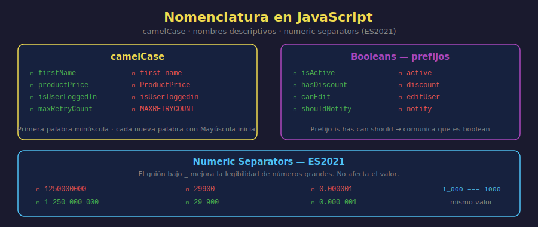

# Nomenclatura y Numeric Separators

## 🎯 Objetivos

- Aplicar la convención camelCase para nombres de variables
- Escribir nombres descriptivos que comuniquen intención
- Usar numeric separators `1_000_000` para legibilidad (ES2021)
- Conocer las convenciones de nomenclatura del bootcamp

---



---

## 1. ¿Por qué importan los nombres?

El código lo escribe una persona y lo leen muchas, incluida tú misma en el futuro. Un nombre descriptivo elimina la necesidad de un comentario.

```javascript
// ❌ Nombres que no dicen nada
const x = 15000;
const y = 48;
const z = x * y;

// ✅ Nombres que comunican intención
const productPrice = 15000;
const stockQuantity = 48;
const totalInventoryValue = productPrice * stockQuantity;
```

La segunda versión se entiende sin ningún comentario.

---

## 2. camelCase — la convención de JavaScript

**camelCase** (camello) escribe la primera palabra en minúscula y cada palabra siguiente con su inicial en mayúscula.

```javascript
// ✅ camelCase — correcto en JavaScript
const firstName = "Ana";
const productPrice = 29900;
const isUserLoggedIn = true;
const maxRetryCount = 3;
const totalOrderAmount = 0;

// ❌ snake_case — no se usa en JS (es convención de Python/SQL)
const first_name = "Ana";
const product_price = 29900;

// ❌ PascalCase — se reserva para clases (semanas futuras)
const FirstName = "Ana";

// ❌ UPPER_SNAKE_CASE — solo para constantes globales de configuración
// (se verá en etapas posteriores)
```

---

## 3. Nombres descriptivos

### Reglas para buenos nombres

```javascript
// ✅ Usar sustantivos para variables de datos
const userName = "Carlos";
const orderTotal = 5400;
const itemCount = 3;

// ✅ Usar verbos/adjetivos para booleans — preferir prefijos is/has/can/should
const isActive = true;
const hasDiscount = false;
const canEdit = true;
const shouldNotify = false;

// ✅ Evitar abreviaciones crípticas
const msg = "hola"; // ❌ ¿qué es msg?
const message = "hola"; // ✅ claro

const usr = "Ana"; // ❌
const user = "Ana"; // ✅

// ✅ Singular para un elemento, plural para colecciones (arrays, semanas futuras)
const product = "Laptop"; // un producto
// const products = [...];  // varios productos — lo veremos en arrays
```

### Longitud apropiada

```javascript
// ❌ Demasiado corto — no dice nada
const n = "Ana García";
const p = 29900;

// ❌ Demasiado largo — dificulta la lectura
const theNameOfTheCurrentlyLoggedInUser = "Ana García";

// ✅ Justo — descriptivo pero conciso
const userName = "Ana García";
const productPrice = 29900;
```

---

## 4. Nomenclatura técnica en inglés

En este bootcamp y en la industria, **el código se escribe en inglés**:

```javascript
// ✅ CORRECTO — nombres en inglés, comentarios en español
const productName = "Laptop Pro"; // nombre del producto
const isAvailable = true; // indica si hay stock
const discountRate = 0.15; // porcentaje de descuento (15%)

// ❌ INCORRECTO — nombres en español
const nombreProducto = "Laptop Pro";
const estaDisponible = true;
const tasaDescuento = 0.15;
```

Razón: el 99% del código, documentación y librerías con las que trabajarás están en inglés.

---

## 5. Numeric separators (ES2021)

Los numeric separators (`_`) son una característica de ES2021 que permite insertar guiones bajos dentro de números literales para mejorar su legibilidad. **No afectan el valor del número**.

```javascript
// ❌ Difícil de leer — ¿cuántos ceros tiene?
const annualRevenue = 1250000000;
const productPrice = 1299900;
const pi = 3.14159265358979;

// ✅ Con numeric separators — igual que poner puntos en un número real
const annualRevenue = 1_250_000_000; // 1.250.000.000
const productPrice = 1_299_900; // 1.299.900
const pi = 3.141_592_653_589_79;

// El valor es exactamente el mismo
console.log(1_000_000 === 1000000); // true

// También funciona con hexadecimales y binarios (avanzado)
const maxColor = 0xff_ff_ff; // color blanco en hex
const bytePattern = 0b1010_0001; // patrón binario
```

### Reglas de los numeric separators

```javascript
// ✅ Válidos
const a = 1_000;
const b = 1_000_000;
const c = 0.000_001;

// ❌ No válidos — generan SyntaxError
// const d = _1000;   // no al inicio
// const e = 1000_;   // no al final
// const f = 1__000;  // no dos seguidos
```

---

## 6. Resumen de convenciones del bootcamp

| Tipo                       | Convención       | Ejemplo                            |
| -------------------------- | ---------------- | ---------------------------------- |
| Variable / función         | camelCase        | `productPrice`, `getUserName`      |
| Constante global de config | UPPER_SNAKE_CASE | `MAX_ITEMS`, `API_URL`             |
| Clase                      | PascalCase       | `UserProfile`, `ShoppingCart`      |
| Archivo JavaScript         | kebab-case       | `user-profile.js`                  |
| Comentarios                | Español          | `// calcula el total con impuesto` |
| Nombres técnicos           | Inglés           | `price`, `isActive`                |

---

## ✅ Checklist de Verificación

- [ ] ¿Todos los nombres siguen camelCase?
- [ ] ¿Los nombres de booleans usan prefijo `is`, `has`, `can` o `should`?
- [ ] ¿Los nombres son en inglés?
- [ ] ¿Los números grandes usan numeric separators para facilitar la lectura?
- [ ] ¿Los nombres comunican intención sin necesitar un comentario?
