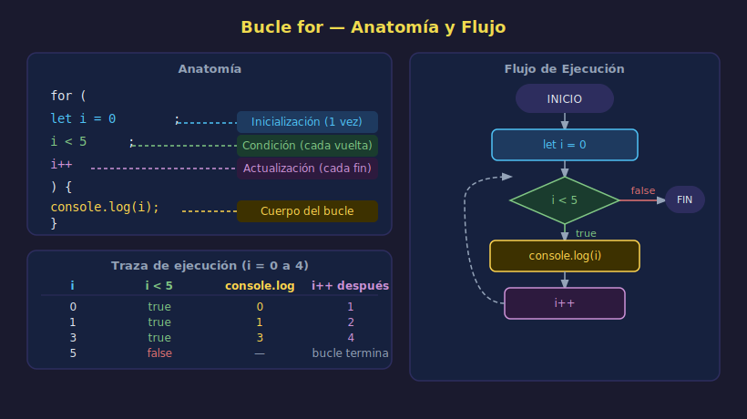

# Bucle `for` Clásico

> **Semana 06 — Teoría 01/05**



---

## 🎯 Objetivos

- Entender la anatomía del bucle `for`
- Saber cuándo usar `for` vs otros tipos de bucle
- Aplicar variantes: contar hacia atrás, saltar de n en n

---

## 1. ¿Qué es un bucle?

Un **bucle** (loop) es una instrucción que repite un bloque de código mientras se cumpla una condición. En lugar de escribir la misma línea 100 veces, escribes el bucle una vez y dejas que la computadora repita.

```javascript
// Sin bucle — repetición manual (❌ poco práctico)
console.log("Mensaje 1");
console.log("Mensaje 2");
console.log("Mensaje 3");

// Con bucle — repetición automática (✅ eficiente)
for (let i = 1; i <= 3; i++) {
  console.log(`Mensaje ${i}`);
}
```

---

## 2. Anatomía del `for`

```
for ( inicialización ; condición ; actualización ) {
        ↑                   ↑             ↑
   Se ejecuta           Se evalúa    Se ejecuta al
   una sola vez         antes de     final de cada
   al inicio            cada vuelta  vuelta
}
```

```javascript
for (let i = 0; i < 5; i++) {
  // Este bloque se ejecuta 5 veces (i = 0, 1, 2, 3, 4)
  console.log(`Vuelta número ${i}`);
}
```

Las tres partes son opcionales, pero la estructura con punto y coma es obligatoria:

| Parte          | Qué hace                                               | Ejemplo típico |
| -------------- | ------------------------------------------------------ | -------------- |
| Inicialización | Declara y asigna el contador                           | `let i = 0`    |
| Condición      | Se evalúa antes de cada vuelta; si es `false`, termina | `i < 5`        |
| Actualización  | Se ejecuta al final de cada vuelta                     | `i++`          |

---

## 3. Ejemplos Fundamentales

### Contar del 1 al 5

```javascript
for (let i = 1; i <= 5; i++) {
  console.log(i); // 1, 2, 3, 4, 5
}
```

### Contar hacia atrás

```javascript
// Cuenta regresiva de 5 a 1
for (let i = 5; i >= 1; i--) {
  console.log(`${i}...`);
}
console.log("¡Despegue!");
```

### Saltar de 2 en 2

```javascript
// Solo números pares del 0 al 10
for (let i = 0; i <= 10; i += 2) {
  console.log(i); // 0, 2, 4, 6, 8, 10
}
```

---

## 4. Acceder a Elementos de un Array por Índice

El `for` clásico es ideal cuando necesitas el **índice** de cada elemento:

```javascript
const planets = ["Mercurio", "Venus", "Tierra", "Marte"];

for (let i = 0; i < planets.length; i++) {
  console.log(`Planeta ${i + 1}: ${planets[i]}`);
}
// Planeta 1: Mercurio
// Planeta 2: Venus
// Planeta 3: Tierra
// Planeta 4: Marte
```

> **Nota**: En JavaScript los arrays empiezan en el índice `0`, no en `1`.
> Por eso usamos `i < planets.length` (no `<=`).

---

## 5. La variable `i` es `let`, no `const`

El contador cambia en cada vuelta, por eso **siempre usa `let`**:

```javascript
// ✅ Correcto
for (let i = 0; i < 3; i++) {
  /* ... */
}

// ❌ Error — 'i' no puede reasignarse con const
for (const i = 0; i < 3; i++) {
  /* TypeError */
}
```

---

## 6. ¿Cuándo usar `for` clásico?

| Situación                                       | ¿Usar `for`?        |
| ----------------------------------------------- | ------------------- |
| Sabes exactamente cuántas veces repetir         | ✅ Sí               |
| Necesitas el índice dentro del cuerpo del bucle | ✅ Sí               |
| Necesitas contar hacia atrás o de n en n        | ✅ Sí               |
| Solo necesitas los valores (sin índice)         | ⚠️ Mejor `for...of` |
| No sabes cuántas veces repetir                  | ⚠️ Mejor `while`    |

---

## ✅ Checklist de Verificación

- [ ] La condición usa `<` o `<=` correctamente (¿`i < length` o `i <= length`?)
- [ ] El contador se declara con `let`
- [ ] La condición eventualmente se vuelve `false` (evitar bucle infinito)
- [ ] El índice se usa dentro del cuerpo si es necesario

---

## 📚 Recursos

- [MDN — for statement](https://developer.mozilla.org/es/docs/Web/JavaScript/Reference/Statements/for)
- [javascript.info — Bucles: while y for](https://es.javascript.info/while-for)
