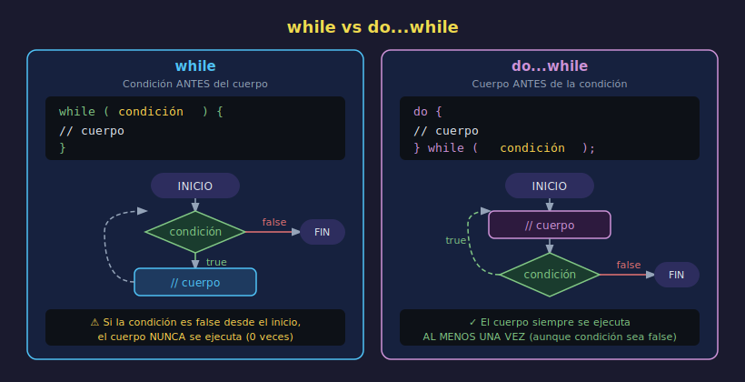

# `while` y `do...while`

> **Semana 06 — Teoría 02/05**



---

## 🎯 Objetivos

- Distinguir `while` de `do...while`
- Saber cuándo usar `while` en lugar de `for`
- Evitar el temido bucle infinito

---

## 1. El bucle `while`

`while` repite un bloque de código **mientras** la condición sea `true`. La condición se evalúa **antes** de ejecutar el cuerpo.

```javascript
while (condición) {
  // Se ejecuta si condición es true
  // Debe existir algo que eventualmente haga condición = false
}
```

### Ejemplo: contar hasta 5

```javascript
let counter = 1;

while (counter <= 5) {
  console.log(`Contador: ${counter}`);
  counter++; // ← FUNDAMENTAL: sin esto, bucle infinito
}
```

> **Regla clave**: el cuerpo del bucle **debe modificar algo** que eventualmente haga la condición `false`. Si no, el programa se congela (bucle infinito).

---

## 2. `while` vs `for`: ¿cuándo usar cada uno?

```javascript
// for — cuando sabes CUÁNTAS veces repetir
for (let i = 0; i < 10; i++) {
  console.log(i);
}

// while — cuando no sabes cuántas veces, depende de una condición
let input = 0;
while (input !== 7) {
  input++; // simula buscar hasta encontrar el valor 7
}
console.log("¡Encontrado!");
```

| Criterio                                | `for`    | `while`  |
| --------------------------------------- | -------- | -------- |
| Número de iteraciones conocido          | ✅ Ideal | Funciona |
| Número de iteraciones desconocido       | Funciona | ✅ Ideal |
| Necesitas counter/índice                | ✅ Ideal | Funciona |
| Condición externa (usuario, dato, etc.) | Difícil  | ✅ Ideal |

---

## 3. El bucle `do...while`

La diferencia con `while`: el cuerpo se ejecuta **al menos una vez**, y la condición se evalúa **después**.

```javascript
do {
  // Se ejecuta SIEMPRE al menos una vez
} while (condición);
```

### Diferencia visual

```javascript
let attempts = 0;

// while — podría no ejecutarse nunca si attempts ya >= 3
while (attempts < 3) {
  console.log(`Intento ${attempts + 1}`);
  attempts++;
}

// do...while — siempre ejecuta al menos una vez
attempts = 0;
do {
  console.log(`Intento ${attempts + 1}`);
  attempts++;
} while (attempts < 3);
```

Cuando `attempts = 5` al inicio:

```javascript
let attempts = 5;

// while — no entra al cuerpo (0 ejecuciones)
while (attempts < 3) {
  console.log("while"); // nunca se imprime
}

// do-while — ejecuta 1 vez antes de revisar la condición
do {
  console.log("do-while"); // se imprime UNA vez
} while (attempts < 3);
```

---

## 4. Caso de Uso: Simulación de Validación

`do...while` es ideal cuando necesitas ejecutar algo **una vez y luego preguntar** si continuar. Un patrón clásico con datos simulados:

```javascript
// Simulamos múltiples intentos de procesar un elemento
const processingQueue = [null, null, "datos-válidos"]; // tercer intento es exitoso
let currentAttempt = 0;
let result = null;

do {
  result = processingQueue[currentAttempt];
  currentAttempt++;
  console.log(`Intento ${currentAttempt}: ${result ?? "sin datos"}`);
} while (result === null && currentAttempt < processingQueue.length);

console.log(`Resultado final: ${result}`);
// Intento 1: sin datos
// Intento 2: sin datos
// Intento 3: datos-válidos
// Resultado final: datos-válidos
```

---

## 5. Peligro: Bucle Infinito

Un bucle infinito congela tu programa. Señales de peligro:

```javascript
// ❌ BUCLE INFINITO — la condición nunca cambia
let x = 0;
while (x < 5) {
  console.log(x);
  // Falta x++ ← el programa se cuelga aquí
}

// ❌ BUCLE INFINITO — condición siempre true
while (true) {
  console.log("infinito");
  // Sin break, esto nunca para
}

// ✅ Correcto — la condición eventualmente es false
let y = 0;
while (y < 5) {
  console.log(y);
  y++; // ← modifica la variable de la condición
}
```

> **Tip**: Si tu programa se queda "colgado", probablemente tienes un bucle infinito. Presiona `Ctrl + C` en la terminal para detenerlo.

---

## ✅ Checklist de Verificación

- [ ] La variable de la condición se modifica dentro del bucle
- [ ] La condición es alcanzable (no `while (true)` sin `break`)
- [ ] Si el cuerpo debe ejecutarse al menos una vez, usa `do...while`
- [ ] Si el número de iteraciones es fijo, considera usar `for`

---

## 📚 Recursos

- [MDN — while](https://developer.mozilla.org/es/docs/Web/JavaScript/Reference/Statements/while)
- [MDN — do...while](https://developer.mozilla.org/es/docs/Web/JavaScript/Reference/Statements/do...while)
