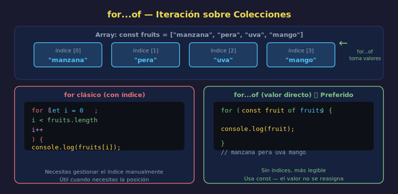

# `for...of` — Iteración Moderna

> **Semana 06 — Teoría 03/05**



---

## 🎯 Objetivos

- Usar `for...of` para iterar sobre arrays y strings
- Entender la diferencia con `for` clásico (valor vs índice)
- Saber cuándo `for...of` es la mejor opción

---

## 1. ¿Qué es `for...of`?

`for...of` es la forma moderna de iterar sobre colecciones. En lugar de trabajar con índices numéricos, te da directamente **el valor** de cada elemento.

```javascript
// for clásico — trabaja con índices
const colors = ["rojo", "verde", "azul"];

for (let i = 0; i < colors.length; i++) {
  console.log(colors[i]); // acceso por índice
}

// for...of — trabaja directamente con valores
for (const color of colors) {
  console.log(color); // ← el valor directamente, sin [i]
}
// rojo
// verde
// azul
```

---

## 2. Sintaxis

```javascript
for (const elemento of coleccion) {
  // elemento tiene el valor de cada ítem
}
```

> **Nota**: usamos `const` (no `let`) porque la variable `elemento` no se reasigna dentro del cuerpo. En cada vuelta, JavaScript crea una nueva variable `const` con el siguiente valor.

---

## 3. `for...of` en Arrays

```javascript
const scores = [85, 92, 78, 96, 60];

for (const score of scores) {
  if (score >= 90) {
    console.log(`⭐ Excelente: ${score}`);
  } else {
    console.log(`Aprobado: ${score}`);
  }
}
// Aprobado: 85
// ⭐ Excelente: 92
// Aprobado: 78
// ⭐ Excelente: 96
// Aprobado: 60
```

---

## 4. `for...of` en Strings

Los strings también son iterables — `for...of` recorre cada carácter:

```javascript
const word = "Hola";

for (const char of word) {
  console.log(char);
}
// H
// o
// l
// a
```

Útil para procesar texto carácter a carácter:

```javascript
const code = "A1B2C3";
let letters = "";
let numbers = "";

for (const char of code) {
  if (isNaN(char)) {
    // isNaN = "is Not a Number"
    letters += char;
  } else {
    numbers += char;
  }
}

console.log(`Letras: ${letters}`); // Letras: ABC
console.log(`Números: ${numbers}`); // Números: 123
```

---

## 5. `for...of` vs `for` clásico

| Criterio                | `for` clásico      | `for...of`       |
| ----------------------- | ------------------ | ---------------- |
| Necesitas el índice     | ✅ Sí (`i`)        | ❌ No disponible |
| Solo necesitas el valor | Funciona (verbose) | ✅ Más limpio    |
| Contar hacia atrás      | ✅ Sí              | ❌ No            |
| Iterar strings          | Funciona           | ✅ Más limpio    |
| Legibilidad             | Más técnico        | ✅ Más expresivo |

```javascript
const items = ["pan", "leche", "huevos"];

// for clásico — necesitas items[i]
for (let i = 0; i < items.length; i++) {
  console.log(items[i]);
}

// for...of — más legible cuando no necesitas el índice
for (const item of items) {
  console.log(item);
}
```

---

## 6. ¿Necesitas el Índice? Usa `entries()`

Si usas `for...of` pero también necesitas el índice, puedes usar `.entries()`:

```javascript
const fruits = ["manzana", "pera", "uva"];

for (const [index, fruit] of fruits.entries()) {
  console.log(`${index + 1}. ${fruit}`);
}
// 1. manzana
// 2. pera
// 3. uva
```

> **Nota**: Esta sintaxis usa **destructuring** de arrays, que aprenderás en detalle en la Semana 11. Por ahora, úsala como patrón si necesitas índice + valor.

---

## ✅ Checklist de Verificación

- [ ] Se usa `const` (no `let`) para la variable del `for...of`
- [ ] La variable tiene un nombre descriptivo (no `x` o `i`)
- [ ] `for...of` se aplica solo cuando no necesitas el índice numérico
- [ ] Para strings, cada iteración da un **carácter** (no una palabra)

---

## 📚 Recursos

- [MDN — for...of](https://developer.mozilla.org/es/docs/Web/JavaScript/Reference/Statements/for...of)
- [javascript.info — for...of y for...in](https://es.javascript.info/array#bucles)
