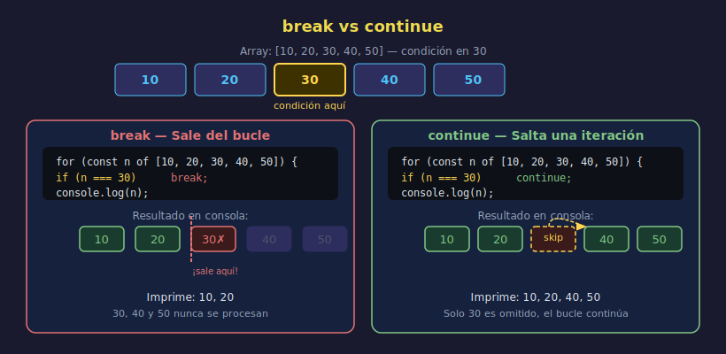

# `break` y `continue`

> **Semana 06 — Teoría 04/05**



---

## 🎯 Objetivos

- Detener un bucle anticipadamente con `break`
- Saltar una iteración específica con `continue`
- Combinarlos con condicionales dentro de bucles

---

## 1. `break` — Salir del Bucle

`break` **termina el bucle inmediatamente**, sin importar si la condición aún es verdadera.

```javascript
// Buscar el primer número par en una lista
const numbers = [1, 3, 7, 4, 9, 2];

for (const num of numbers) {
  if (num % 2 === 0) {
    console.log(`Primer par encontrado: ${num}`);
    break; // ← sale del bucle inmediatamente
  }
  console.log(`${num} es impar, sigo buscando...`);
}
// 1 es impar, sigo buscando...
// 3 es impar, sigo buscando...
// 7 es impar, sigo buscando...
// Primer par encontrado: 4
```

Sin `break`, el bucle continuaría hasta el final aunque ya encontramos lo que buscábamos.

---

## 2. `continue` — Saltar una Iteración

`continue` **salta al siguiente ciclo del bucle**, omitiendo el resto del cuerpo para esa iteración.

```javascript
// Imprimir solo números impares
const numbers = [1, 2, 3, 4, 5, 6];

for (const num of numbers) {
  if (num % 2 === 0) {
    continue; // ← salta los pares, continúa con el siguiente
  }
  console.log(num); // solo se ejecuta para impares
}
// 1
// 3
// 5
```

---

## 3. Diferencia Visual

```
Lista: [A, B, C, D, E]

Con break en C:          Con continue en C:
  → A  (imprime A)         → A  (imprime A)
  → B  (imprime B)         → B  (imprime B)
  → C  (¡break! sale)      → C  (continue, salta)
  ✗ D  (no llega)          → D  (imprime D)
  ✗ E  (no llega)          → E  (imprime E)

Resultado: A, B            Resultado: A, B, D, E
```

---

## 4. `break` en `for` Clásico

`break` funciona igual en todos los tipos de bucle:

```javascript
// Buscar en un array por índice
const catalog = ["silla", "mesa", "lámpara", "sofá", "cama"];
const target = "lámpara";
let foundIndex = -1;

for (let i = 0; i < catalog.length; i++) {
  if (catalog[i] === target) {
    foundIndex = i;
    break; // ya no necesitamos seguir buscando
  }
}

console.log(
  foundIndex !== -1
    ? `"${target}" encontrada en posición ${foundIndex}`
    : `"${target}" no encontrada`,
);
// "lámpara" encontrada en posición 2
```

---

## 5. `continue` en `for` Clásico

```javascript
// Procesar solo elementos válidos (ignorar los null)
const readings = [22, null, 18, null, 25, 19];

for (let i = 0; i < readings.length; i++) {
  if (readings[i] === null) {
    continue; // omitir lecturas inválidas
  }
  console.log(`Lectura ${i}: ${readings[i]}°C`);
}
// Lectura 0: 22°C
// Lectura 2: 18°C
// Lectura 4: 25°C
// Lectura 5: 19°C
```

---

## 6. `break` en `while`

```javascript
// Simular búsqueda hasta encontrar valor o agotar intentos
const maxAttempts = 10;
let attempt = 0;
let found = false;

while (attempt < maxAttempts) {
  attempt++;
  // Simular: el valor correcto es el intento número 6
  if (attempt === 6) {
    found = true;
    break;
  }
}

console.log(
  found
    ? `Encontrado en el intento ${attempt}`
    : `No encontrado en ${maxAttempts} intentos`,
);
// Encontrado en el intento 6
```

---

## 7. ⚠️ `break` solo sale del bucle más interno

En bucles anidados (que veremos en la próxima sección), `break` solo sale del bucle donde se encuentra, no de todos a la vez:

```javascript
for (let row = 0; row < 3; row++) {
  for (let col = 0; col < 3; col++) {
    if (col === 1) {
      break; // ← sale del bucle de 'col', no del de 'row'
    }
    console.log(`[${row},${col}]`);
  }
}
// [0,0]
// [1,0]
// [2,0]
```

---

## ✅ Checklist de Verificación

- [ ] `break` termina el bucle completo (no solo esa iteración)
- [ ] `continue` salta al siguiente ciclo (el bucle sigue)
- [ ] Ambos van siempre dentro de una condición `if`
- [ ] En bucles anidados, `break` afecta solo el bucle más interno

---

## 📚 Recursos

- [MDN — break](https://developer.mozilla.org/es/docs/Web/JavaScript/Reference/Statements/break)
- [MDN — continue](https://developer.mozilla.org/es/docs/Web/JavaScript/Reference/Statements/continue)
