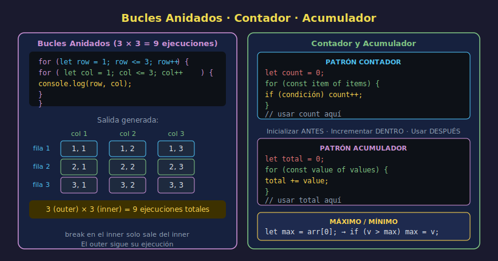

# Bucles Anidados, Contadores y Acumuladores

> **Semana 06 — Teoría 05/05**



---

## 🎯 Objetivos

- Construir bucles anidados para datos bidimensionales
- Usar el patrón **contador** para contar eventos
- Usar el patrón **acumulador** para sumar, concatenar o agregar resultados
- Encontrar el máximo y el mínimo de una lista

---

## 1. Bucles Anidados

Un **bucle anidado** es un bucle dentro de otro bucle. El bucle interno se ejecuta completamente por cada iteración del bucle externo.

```javascript
// Generar una tabla de multiplicar
for (let row = 1; row <= 3; row++) {
  // 3 filas
  for (let col = 1; col <= 3; col++) {
    // 3 columnas por fila
    console.log(`${row} x ${col} = ${row * col}`);
  }
}
// 1 x 1 = 1
// 1 x 2 = 2
// 1 x 3 = 3
// 2 x 1 = 2
// ...
// 3 x 3 = 9
```

### ¿Cuántas veces se ejecuta el cuerpo interno?

```
Externo: 3 iteraciones
Interno: 3 iteraciones por cada externo
Total:   3 × 3 = 9 ejecuciones
```

---

## 2. Ejemplo Práctico: Asientos en un Cine

```javascript
const rows = 3; // filas
const seatsPerRow = 5; // asientos por fila

for (let row = 1; row <= rows; row++) {
  for (let seat = 1; seat <= seatsPerRow; seat++) {
    const seatId = `F${row}-A${seat}`;
    console.log(`Asiento: ${seatId}`);
  }
}
// Asiento: F1-A1
// Asiento: F1-A2
// ...
// Asiento: F3-A5
```

---

## 3. Patrón Contador

Un **contador** cuenta cuántas veces ocurre algo. Siempre sigue este patrón:

```javascript
let count = 0;          // 1. Inicializar en 0 ANTES del bucle

for (const item of items) {
  if (/* condición */) {
    count++;            // 2. Incrementar dentro del bucle
  }
}

console.log(count);     // 3. Usar DESPUÉS del bucle
```

### Ejemplo

```javascript
const temperatures = [22, 35, 18, 41, 27, 38, 15];
let hotDays = 0; // contador de días calurosos

for (const temp of temperatures) {
  if (temp > 30) {
    hotDays++;
  }
}

console.log(`Días con más de 30°C: ${hotDays}`); // 3
```

---

## 4. Patrón Acumulador

Un **acumulador** junta o suma valores durante el bucle:

```javascript
let total = 0; // 1. Inicializar ANTES del bucle

for (const item of items) {
  total += item; // 2. Acumular en cada vuelta
}

console.log(total); // 3. Usar DESPUÉS del bucle
```

### Acumular números (suma)

```javascript
const prices = [12.5, 8.0, 25.0, 4.5, 15.0];
let total = 0;

for (const price of prices) {
  total += price;
}

console.log(`Total: $${total}`); // Total: $65
```

### Acumular strings (construir texto)

```javascript
const words = ["JavaScript", "es", "moderno"];
let sentence = "";

for (const word of words) {
  sentence += word + " ";
}

console.log(sentence.trim()); // "JavaScript es moderno"
```

### Acumular en un array (filtrar/transformar)

```javascript
const allScores = [55, 78, 90, 45, 82, 67];
const approvedScores = []; // acumulador tipo array

for (const score of allScores) {
  if (score >= 60) {
    approvedScores.push(score); // .push() agrega al final
  }
}

console.log(approvedScores); // [78, 90, 82, 67]
```

---

## 5. Encontrar el Máximo y el Mínimo

Patrón para encontrar el valor más grande de una lista:

```javascript
const measurements = [34, 67, 21, 89, 45, 12];

let maxValue = measurements[0]; // empezamos asumiendo que el primero es el máximo

for (const value of measurements) {
  if (value > maxValue) {
    maxValue = value; // encontramos uno más grande, actualizamos
  }
}

console.log(`Máximo: ${maxValue}`); // Máximo: 89
```

Y para el mínimo, solo cambias `>` por `<`:

```javascript
let minValue = measurements[0];

for (const value of measurements) {
  if (value < minValue) {
    minValue = value;
  }
}

console.log(`Mínimo: ${minValue}`); // Mínimo: 12
```

---

## 6. Combinar Patrones

Puedes usar contador, acumulador y máximo/mínimo **en el mismo bucle**:

```javascript
const ratings = [4, 5, 3, 5, 2, 4, 5, 3];

let total = 0;
let countFive = 0;
let minRating = ratings[0];

for (const rating of ratings) {
  total += rating;

  if (rating === 5) {
    countFive++;
  }

  if (rating < minRating) {
    minRating = rating;
  }
}

const average = total / ratings.length;

console.log(`Promedio: ${average.toFixed(1)}`); // 3.9
console.log(`Calificaciones perfectas: ${countFive}`); // 3
console.log(`Peor calificación: ${minRating}`); // 2
```

---

## ⚠️ Error Común: Inicializar dentro del Bucle

```javascript
// ❌ INCORRECTO — el contador se resetea en cada vuelta
for (const item of items) {
  let count = 0; // ← resetea a 0 en cada iteración
  count++;
}
console.log(count); // Error: count no existe aquí

// ✅ CORRECTO — el contador se inicializa ANTES del bucle
let count = 0;
for (const item of items) {
  count++;
}
console.log(count); // funciona correctamente
```

---

## ✅ Checklist de Verificación

- [ ] Contadores y acumuladores se inicializan **antes** del bucle
- [ ] En bucles anidados, los contadores tienen nombres distintos (`i`, `j` o nombres descriptivos)
- [ ] El acumulador correcto para suma empieza en `0`, para producto en `1`
- [ ] Para máximo/mínimo, se inicializa con el primer elemento del array (`array[0]`)

---

## 📚 Recursos

- [MDN — Array.push()](https://developer.mozilla.org/es/docs/Web/JavaScript/Reference/Global_Objects/Array/push)
- [javascript.info — Tareas con bucles](https://es.javascript.info/while-for#tareas)
